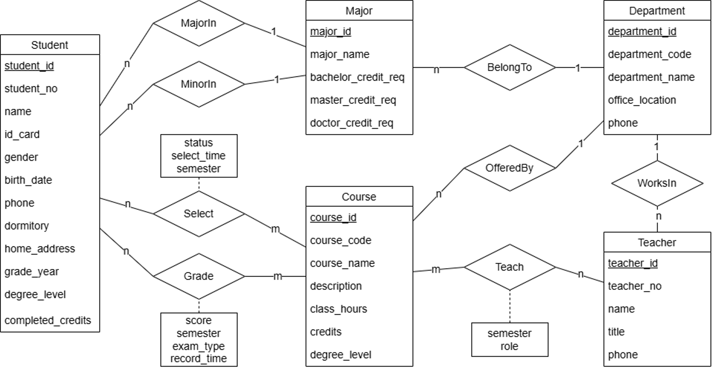

# 学生成绩数据库系统项目文档

本文档用于补充 `README.md` 中没有展开的设计与实现细节，按照课程提交要求拆分为三部分：数据库设计文档、代码文档、用户操作文档。基础使用说明见项目根目录的 `README.md`。

## 第一部分 数据库设计文档

本部分包括 ER 图、表结构定义及实体关系说明。

### 1. ER 图



ER 图展示了学生、院系、专业、课程、教师、授课、选课和成绩之间的主要联系。系统最终实现时在基础成绩管理模型上增加了 `title`、`users`、`system_log` 等辅助表，用于职称管理、账号权限管理和操作日志记录。

### 2. 核心实体

| 实体 | 对应表 | 说明 |
| --- | --- | --- |
| 院系 | `department` | 维护院系代码、名称、办公地点和联系电话。 |
| 专业 | `major` | 维护专业名称、所属院系，以及本科、硕士、博士学分要求。 |
| 学生 | `student` | 维护学生基本信息、主修专业、辅修专业、年级和学位等级。 |
| 课程 | `course` | 维护课程编号、名称、说明、学时、学分、学位等级和开课院系。 |
| 职称 | `title` | 维护教师职称名称和职称等级。 |
| 教师 | `teacher` | 维护教师编号、姓名、所属院系、职称和电话。 |
| 授课安排 | `teacher_course` | 记录教师在某学期讲授某课程的安排、授课角色和结课状态。 |
| 选课记录 | `student_course` | 记录学生在某学期选修某课程的当前有效选课关系。 |
| 成绩 | `grade` | 记录学生某门课程在某学期的正考、补考或重修成绩。 |
| 用户账号 | `users` | 维护登录账号、密码哈希、角色、绑定教师或学生、启用状态。 |
| 系统日志 | `system_log` | 记录登录、增删改、重置密码、启停账号等系统操作。 |

### 3. 设计原则

- 主键统一使用自增 ID 或复合主键，保证每条记录可以唯一定位。
- 院系、专业、教师、课程等基础数据之间通过外键建立引用关系。
- 教师与课程、学生与课程均为多对多关系，分别通过 `teacher_course` 和 `student_course` 拆分。
- 课程本身不保存“是否结课”，结课状态保存在 `teacher_course.course_status` 中，表示某门课程在某个学期的授课状态。
- 学生所属院系由主修专业推导，不在学生表中重复保存院系 ID，减少传递依赖。
- 学生已修学分由已结课且成绩合格的课程自动计算，补考和重修合格可计入学分，重复课程只计一次。

### 4. 表结构定义

#### 4.1 `department` 院系表

| 字段 | 类型 | 约束 | 说明 |
| --- | --- | --- | --- |
| `department_id` | INT | PK, AUTO_INCREMENT | 院系主键。 |
| `department_code` | VARCHAR(20) | NOT NULL, UNIQUE | 院系代码。 |
| `department_name` | VARCHAR(100) | NOT NULL, UNIQUE | 院系名称。 |
| `office_location` | VARCHAR(100) | NULL | 办公地点。 |
| `phone` | VARCHAR(30) | NULL | 联系电话。 |
| `created_at` | TIMESTAMP | DEFAULT CURRENT_TIMESTAMP | 创建时间。 |
| `updated_at` | TIMESTAMP | ON UPDATE CURRENT_TIMESTAMP | 更新时间。 |

#### 4.2 `major` 专业表

| 字段 | 类型 | 约束 | 说明 |
| --- | --- | --- | --- |
| `major_id` | INT | PK, AUTO_INCREMENT | 专业主键。 |
| `major_name` | VARCHAR(100) | NOT NULL | 专业名称。 |
| `department_id` | INT | FK, NOT NULL | 所属院系。 |
| `bachelor_credit_req` | DECIMAL(5,1) | CHECK >= 0 | 本科学分要求。 |
| `master_credit_req` | DECIMAL(5,1) | CHECK >= 0 | 硕士学分要求。 |
| `doctor_credit_req` | DECIMAL(5,1) | CHECK >= 0 | 博士学分要求。 |
| `created_at` | TIMESTAMP | DEFAULT CURRENT_TIMESTAMP | 创建时间。 |
| `updated_at` | TIMESTAMP | ON UPDATE CURRENT_TIMESTAMP | 更新时间。 |

约束：`UNIQUE(department_id, major_name)` 保证同一院系下专业名称不重复。

#### 4.3 `student` 学生表

| 字段 | 类型 | 约束 | 说明 |
| --- | --- | --- | --- |
| `student_id` | INT | PK, AUTO_INCREMENT | 学生主键。 |
| `student_no` | VARCHAR(30) | NOT NULL, UNIQUE | 学号。 |
| `name` | VARCHAR(50) | NOT NULL | 姓名。 |
| `id_card` | VARCHAR(30) | NOT NULL, UNIQUE | 身份证号。 |
| `gender` | VARCHAR(10) | CHECK IN ('男','女') | 性别。 |
| `birth_date` | DATE | NULL | 出生日期。 |
| `dormitory` | VARCHAR(100) | NULL | 宿舍。 |
| `home_address` | VARCHAR(255) | NULL | 家庭地址。 |
| `phone` | VARCHAR(30) | NULL | 电话。 |
| `grade_year` | INT | CHECK BETWEEN 2000 AND 2100 | 年级。 |
| `major_id` | INT | FK, NOT NULL | 主修专业。 |
| `minor_id` | INT | FK, NULL | 辅修专业。 |
| `degree_level` | VARCHAR(20) | CHECK IN ('本科','硕士','博士') | 学位等级。 |
| `completed_credits` | DECIMAL(6,1) | CHECK >= 0 | 已修学分字段。 |
| `created_at` | TIMESTAMP | DEFAULT CURRENT_TIMESTAMP | 创建时间。 |
| `updated_at` | TIMESTAMP | ON UPDATE CURRENT_TIMESTAMP | 更新时间。 |

说明：页面展示的已修学分由成绩自动计算，条件为“课程已结课且最终有效成绩及格”。`completed_credits` 字段保留用于满足课程要求和兼容表结构，但管理员页面不直接手动修改该值。

#### 4.4 `course` 课程表

| 字段 | 类型 | 约束 | 说明 |
| --- | --- | --- | --- |
| `course_id` | INT | PK, AUTO_INCREMENT | 课程主键。 |
| `course_code` | VARCHAR(30) | NOT NULL, UNIQUE | 课程编号。 |
| `course_name` | VARCHAR(100) | NOT NULL | 课程名称。 |
| `course_description` | TEXT | NULL | 课程说明。 |
| `class_hours` | INT | CHECK > 0 | 学时。 |
| `credits` | DECIMAL(4,1) | CHECK > 0 | 学分。 |
| `degree_level` | VARCHAR(20) | CHECK IN ('本科','硕士','博士') | 学位等级。 |
| `department_id` | INT | FK, NOT NULL | 开课院系。 |
| `created_at` | TIMESTAMP | DEFAULT CURRENT_TIMESTAMP | 创建时间。 |
| `updated_at` | TIMESTAMP | ON UPDATE CURRENT_TIMESTAMP | 更新时间。 |

说明：课程表只保存课程基础信息，不保存结课状态；结课状态由授课安排表按学期维护。

#### 4.5 `title` 职称表

| 字段 | 类型 | 约束 | 说明 |
| --- | --- | --- | --- |
| `title_id` | INT | PK, AUTO_INCREMENT | 职称主键。 |
| `title_name` | VARCHAR(50) | NOT NULL, UNIQUE | 职称名称。 |
| `title_level` | INT | CHECK > 0 | 职称等级。 |
| `created_at` | TIMESTAMP | DEFAULT CURRENT_TIMESTAMP | 创建时间。 |
| `updated_at` | TIMESTAMP | ON UPDATE CURRENT_TIMESTAMP | 更新时间。 |

#### 4.6 `teacher` 教师表

| 字段 | 类型 | 约束 | 说明 |
| --- | --- | --- | --- |
| `teacher_id` | INT | PK, AUTO_INCREMENT | 教师主键。 |
| `teacher_no` | VARCHAR(30) | NOT NULL, UNIQUE | 教师编号。 |
| `name` | VARCHAR(50) | NOT NULL | 教师姓名。 |
| `department_id` | INT | FK, NOT NULL | 所属院系。 |
| `title_id` | INT | FK, NULL | 职称。 |
| `phone` | VARCHAR(30) | NULL | 电话。 |
| `created_at` | TIMESTAMP | DEFAULT CURRENT_TIMESTAMP | 创建时间。 |
| `updated_at` | TIMESTAMP | ON UPDATE CURRENT_TIMESTAMP | 更新时间。 |

#### 4.7 `teacher_course` 授课安排表

| 字段 | 类型 | 约束 | 说明 |
| --- | --- | --- | --- |
| `teacher_id` | INT | PK, FK | 任课教师。 |
| `course_id` | INT | PK, FK | 授课课程。 |
| `semester` | VARCHAR(30) | PK | 开课学期。 |
| `teaching_role` | VARCHAR(20) | CHECK IN ('主讲','助教','合上') | 授课角色。 |
| `course_status` | VARCHAR(20) | CHECK IN ('open','closed') | 结课状态。 |
| `created_at` | TIMESTAMP | DEFAULT CURRENT_TIMESTAMP | 创建时间。 |

说明：复合主键 `(teacher_id, course_id, semester)` 保证同一教师在同一学期对同一课程不会重复安排。`course_status='open'` 表示未结课，`course_status='closed'` 表示已结课。

#### 4.8 `student_course` 选课表

| 字段 | 类型 | 约束 | 说明 |
| --- | --- | --- | --- |
| `student_id` | INT | PK, FK | 学生。 |
| `course_id` | INT | PK, FK | 课程。 |
| `semester` | VARCHAR(30) | PK | 选课学期。 |
| `enroll_status` | VARCHAR(20) | CHECK IN ('已选','退课','已完成') | 选课状态字段。 |
| `enrolled_at` | TIMESTAMP | DEFAULT CURRENT_TIMESTAMP | 选课时间。 |

说明：当前页面逻辑把 `student_course` 作为“当前有效选课记录”使用。管理员添加记录表示学生选课；删除记录表示学生退课或取消选课。退课历史不在选课表中继续展示，而由系统日志记录删除操作。如果该选课记录已有成绩，则系统限制删除。

#### 4.9 `grade` 成绩表

| 字段 | 类型 | 约束 | 说明 |
| --- | --- | --- | --- |
| `grade_id` | INT | PK, AUTO_INCREMENT | 成绩主键。 |
| `student_id` | INT | FK, NOT NULL | 学生。 |
| `course_id` | INT | FK, NOT NULL | 课程。 |
| `semester` | VARCHAR(30) | NOT NULL | 学期。 |
| `score` | DECIMAL(5,2) | CHECK BETWEEN 0 AND 100 | 分数。 |
| `exam_type` | VARCHAR(20) | CHECK IN ('正考','补考','重修') | 考试类型。 |
| `record_time` | TIMESTAMP | DEFAULT CURRENT_TIMESTAMP | 记录时间。 |
| `updated_at` | TIMESTAMP | ON UPDATE CURRENT_TIMESTAMP | 更新时间。 |

约束：`UNIQUE(student_id, course_id, semester, exam_type)` 保证同一学生、同一课程、同一学期、同一考试类型只保存一条成绩。

#### 4.10 `users` 用户表

| 字段 | 类型 | 约束 | 说明 |
| --- | --- | --- | --- |
| `user_id` | INT | PK, AUTO_INCREMENT | 用户主键。 |
| `username` | VARCHAR(50) | NOT NULL, UNIQUE | 用户名。 |
| `password_hash` | VARCHAR(255) | NOT NULL | 密码哈希。 |
| `role` | VARCHAR(20) | CHECK IN ('admin','teacher','student') | 用户角色。 |
| `related_student_id` | INT | FK, NULL | 绑定学生。 |
| `related_teacher_id` | INT | FK, NULL | 绑定教师。 |
| `is_active` | TINYINT(1) | CHECK IN (0,1) | 是否启用。 |
| `must_change_password` | TINYINT(1) | CHECK IN (0,1) | 是否必须修改密码。 |
| `created_at` | TIMESTAMP | DEFAULT CURRENT_TIMESTAMP | 创建时间。 |
| `updated_at` | TIMESTAMP | ON UPDATE CURRENT_TIMESTAMP | 更新时间。 |

说明：管理员账号不绑定教师或学生；教师账号只能绑定教师；学生账号只能绑定学生。

#### 4.11 `system_log` 系统日志表

| 字段 | 类型 | 约束 | 说明 |
| --- | --- | --- | --- |
| `log_id` | INT | PK, AUTO_INCREMENT | 日志主键。 |
| `user_id` | INT | FK, NULL | 操作用户。 |
| `action` | VARCHAR(100) | NOT NULL | 操作类型。 |
| `detail` | VARCHAR(255) | NULL | 操作详情。 |
| `created_at` | TIMESTAMP | DEFAULT CURRENT_TIMESTAMP | 操作时间。 |

### 5. 关系说明

| 关系 | 类型 | 实现方式 |
| --- | --- | --- |
| 院系 - 专业 | 1:n | `major.department_id` 引用 `department.department_id`。 |
| 专业 - 学生 | 1:n | `student.major_id` 引用 `major.major_id`。 |
| 专业 - 学生辅修 | 1:n，可为空 | `student.minor_id` 引用 `major.major_id`，允许为空。 |
| 院系 - 课程 | 1:n | `course.department_id` 引用 `department.department_id`。 |
| 院系 - 教师 | 1:n | `teacher.department_id` 引用 `department.department_id`。 |
| 职称 - 教师 | 1:n | `teacher.title_id` 引用 `title.title_id`。 |
| 教师 - 课程 | n:m | 通过 `teacher_course` 表实现，并增加学期、授课角色、结课状态。 |
| 学生 - 课程 | n:m | 通过 `student_course` 表实现，并增加学期、选课时间等信息。 |
| 学生/课程 - 成绩 | 1:n | `grade.student_id` 和 `grade.course_id` 分别引用学生与课程。 |
| 用户 - 学生 | 0/1:1 | 学生账号通过 `users.related_student_id` 绑定学生。 |
| 用户 - 教师 | 0/1:1 | 教师账号通过 `users.related_teacher_id` 绑定教师。 |
| 用户 - 系统日志 | 1:n | 一个用户可以产生多条系统日志。 |

#### 5.1 完整性约束

- 实体完整性：所有主表均设置主键，`student_course` 和 `teacher_course` 使用复合主键。
- 参照完整性：外键约束保证专业必须属于已存在院系，学生必须关联已存在专业，成绩必须关联已存在学生和课程。
- 唯一性约束：院系代码、院系名称、课程编号、学号、身份证号、教师编号、用户名等字段设置唯一约束。
- 取值约束：性别、学位等级、授课角色、课程状态、考试类型、账号角色等字段使用 `CHECK` 限制取值范围。
- 删除约束：被专业、课程、教师引用的院系不允许直接删除；删除学生或课程时，相关选课和成绩记录随外键规则处理。

#### 5.2 第三范式说明

系统设计满足第三范式：

- 第一范式：字段均为原子值，例如电话、学号、课程编号等不在同一字段中存放多个值。
- 第二范式：复合主键表中的非主属性依赖完整复合主键，例如 `student_course.enrolled_at` 依赖学生、课程和学期三者共同确定。
- 第三范式：非主属性之间不存在传递依赖，例如学生表只保存 `major_id`，学生所属院系通过专业表推导；教师表只保存 `title_id`，职称名称和等级由职称表维护。

## 第二部分 代码文档

本部分包括后端 API / 路由说明、数据库访问逻辑、权限控制、日志记录及关键业务逻辑。

### 1. 后端 API / 路由说明

本项目采用 Flask 服务端渲染页面，后端接口主要表现为页面路由和表单提交路由，而不是纯 JSON API。

#### 1.1 认证与首页

| 路由 | 方法 | 角色 | 功能 |
| --- | --- | --- | --- |
| `/` | GET | 全部 | 跳转到登录页或角色首页。 |
| `/login` | GET/POST | 全部 | 展示登录页并处理登录表单。 |
| `/logout` | GET | 已登录 | 清空会话并退出登录。 |
| `/change-password` | GET/POST | 已登录 | 当前用户修改自己的密码。 |
| `/dashboard` | GET | 已登录 | 按角色展示功能入口。 |

#### 1.2 管理员基础数据路由

| 模块 | 路由形式 | 方法 | 功能 |
| --- | --- | --- | --- |
| 院系管理 | `/departments/`, `/departments/new`, `/departments/<id>/edit`, `/departments/<id>/delete` | GET/POST | 院系增删改查。 |
| 专业管理 | `/majors/`, `/majors/new`, `/majors/<id>/edit`, `/majors/<id>/delete` | GET/POST | 专业增删改查。 |
| 课程管理 | `/courses/`, `/courses/new`, `/courses/<id>/edit`, `/courses/<id>/delete` | GET/POST | 课程增删改查。 |
| 职称管理 | `/titles/`, `/titles/new`, `/titles/<id>/edit`, `/titles/<id>/delete` | GET/POST | 职称字典增删改查。 |
| 教师管理 | `/teachers/`, `/teachers/new`, `/teachers/<id>/edit`, `/teachers/<id>/delete` | GET/POST | 教师增删改查，并关联院系和职称。 |
| 学生管理 | `/students/`, `/students/new`, `/students/<id>/edit`, `/students/<id>/delete` | GET/POST | 学生增删改查，并按年级、学位等筛选。 |

#### 1.3 授课、选课与成绩路由

| 路由 | 方法 | 角色 | 功能 |
| --- | --- | --- | --- |
| `/teaching/` | GET | 管理员 | 查询授课安排，可按教师、课程、学期、课程状态筛选。 |
| `/teaching/new` | GET/POST | 管理员 | 新增授课安排。 |
| `/teaching/<teacher_id>/<course_id>/<semester>/edit` | GET/POST | 管理员 | 编辑授课教师、课程、学期、授课角色和结课状态。 |
| `/teaching/<teacher_id>/<course_id>/<semester>/delete` | POST | 管理员 | 删除授课安排。 |
| `/enrollments/` | GET | 管理员 | 查询学生选课记录。 |
| `/enrollments/new` | GET/POST | 管理员 | 添加学生选课记录。 |
| `/enrollments/<student_id>/<course_id>/<semester>/edit` | GET/POST | 管理员 | 编辑选课记录。 |
| `/enrollments/<student_id>/<course_id>/<semester>/delete` | POST | 管理员 | 删除选课记录；已有成绩时禁止删除。 |
| `/grades/` | GET | 管理员/教师/学生 | 按角色进入成绩查询或成绩管理页面。 |
| `/grades/course/<course_id>/<semester>` | GET | 教师 | 查看某门课程当前所有成绩记录。 |
| `/grades/new` | GET/POST | 教师 | 对未结课课程录入成绩。 |
| `/grades/<grade_id>/edit` | GET/POST | 教师 | 修改未结课课程成绩。 |
| `/grades/<grade_id>/delete` | POST | 教师 | 删除未结课课程成绩。 |

#### 1.4 统计、教师端与学生端路由

| 路由 | 方法 | 角色 | 功能 |
| --- | --- | --- | --- |
| `/statistics/` | GET | 管理员 | 按学期或开课院系筛选课程列表。 |
| `/statistics/course/<course_id>/<semester>` | GET | 管理员 | 查看单门课程统计详情。 |
| `/statistics/teacher` | GET | 教师 | 按学期筛选本人授课课程。 |
| `/statistics/teacher/course/<course_id>/<semester>` | GET | 教师 | 查看本人课程统计详情。 |
| `/teacher/courses` | GET | 教师 | 查看本人授课课程。 |
| `/teacher/students` | GET | 教师 | 查看某门课程的选课学生名单。 |
| `/student/profile` | GET | 学生 | 查看本人基本信息。 |
| `/student/courses` | GET | 学生 | 按学期查看本人选课和学分统计。 |

#### 1.5 用户与系统管理路由

| 路由 | 方法 | 角色 | 功能 |
| --- | --- | --- | --- |
| `/system/` | GET | 管理员 | 用户与系统管理入口。 |
| `/system/users` | GET | 管理员 | 用户账号列表。 |
| `/system/users/new` | GET/POST | 管理员 | 新增用户账号并设置初始密码。 |
| `/system/users/<id>/edit` | GET/POST | 管理员 | 编辑用户角色和绑定对象。 |
| `/system/users/<id>/reset-password` | GET/POST | 管理员 | 重置用户密码并要求下次登录修改。 |
| `/system/users/<id>/toggle` | POST | 管理员 | 启用或停用账号。 |
| `/system/permissions` | GET | 管理员 | 查看权限说明。 |
| `/system/logs` | GET | 管理员 | 查询系统操作日志。 |
| `/system/backup` | GET | 管理员 | 查看备份说明页面。 |

### 2. 数据库访问逻辑

#### 2.1 连接封装

数据库连接统一由 `models/db.py` 中的 `get_connection()` 创建：

```python
def get_connection():
    return pymysql.connect(
        host=current_app.config["DB_HOST"],
        port=current_app.config["DB_PORT"],
        user=current_app.config["DB_USER"],
        password=current_app.config["DB_PASSWORD"],
        database=current_app.config["DB_NAME"],
        charset=current_app.config["DB_CHARSET"],
        cursorclass=pymysql.cursors.DictCursor,
        autocommit=False,
    )
```

`DictCursor` 让查询结果可以通过字段名访问，便于模板渲染；`autocommit=False` 让新增、修改、删除操作必须显式 `commit()`，避免半完成写入。

#### 2.2 查询与写入流程

典型请求流程如下：

1. 路由函数读取 `request.args` 或 `request.form` 中的输入。
2. 表单校验函数检查必填项、枚举值、数字范围和外键选择。
3. 使用 `with get_connection() as conn` 创建连接。
4. 使用 `with conn.cursor() as cursor` 创建游标。
5. 使用 `cursor.execute(sql, params)` 执行参数化 SQL。
6. 查询操作使用 `fetchone()` 或 `fetchall()` 获取结果。
7. 写操作执行成功后调用 `conn.commit()`。
8. 捕获 `IntegrityError` 或 `MySQLError`，向页面返回错误提示。

#### 2.3 参数化 SQL 与防注入

系统中所有用户输入都通过参数绑定传入 SQL，而不是直接拼接到 SQL 字符串中。例如登录查询：

```python
cursor.execute(
    """
    SELECT user_id, username, password_hash, role,
           related_student_id, related_teacher_id,
           is_active, must_change_password
    FROM users
    WHERE username = %s
    """,
    (username,),
)
```

模糊查询也使用参数列表：

```python
sql += " AND (s.student_no LIKE %s OR s.name LIKE %s)"
like_keyword = f"%{keyword}%"
params.extend([like_keyword, like_keyword])
cursor.execute(sql, params)
```

这样用户输入会被数据库驱动当作普通参数值处理，即使输入中包含引号、注释符或 SQL 关键字，也不会改变原 SQL 语句结构。

#### 2.4 权限控制

权限控制集中在 `routes/permissions.py`：

```python
@role_required("admin")
def list_students():
    ...
```

主要规则：

- 未登录用户不能访问后台页面。
- 管理员可以维护基础数据、授课、选课、用户和日志，但不能修改成绩。
- 教师只能访问本人授课课程，只能对未结课课程录入、修改或删除成绩。
- 学生只能查看本人信息、本人选课和本人已结课课程成绩。

#### 2.5 日志记录

`app.py` 中的 `after_request` 钩子会在部分 POST 操作成功跳转后写入系统日志：

```python
@app.after_request
def record_system_log(response):
    if request.method == "POST" and response.status_code in (302, 303):
        action = _audit_action_name(request.endpoint)
        if action:
            _write_system_log(
                user_id=session.get("user_id"),
                action=action,
                detail=f"{request.method} {request.path}",
            )
    return response
```

日志用于追踪登录、修改密码、增删改基础数据、重置密码、启停账号等操作。选课记录删除后，业务表不再展示该记录，但日志中仍可看到删除操作。

#### 2.6 关键业务逻辑

**已修学分计算：**

```sql
SELECT COALESCE(SUM(passed_course.credits), 0) AS completed_credits
FROM (
    SELECT c.course_id, MAX(c.credits) AS credits
    FROM grade g
    JOIN course c ON g.course_id = c.course_id
    WHERE g.student_id = %s
      AND g.score >= 60
      AND EXISTS (
          SELECT 1
          FROM teacher_course tc
          WHERE tc.course_id = g.course_id
            AND tc.semester = g.semester
            AND tc.course_status = 'closed'
      )
    GROUP BY c.course_id
) AS passed_course
```

该逻辑保证课程必须已结课、成绩必须及格，补考和重修及格也可计入学分，同一课程只计一次。

**学生成绩查询：**

学生按学期查询成绩时，只返回已结课课程。对同一学生、同一课程、同一学期的多次考试记录，系统取最高分作为最终有效成绩：

```sql
SELECT student_id, course_id, semester, MAX(score) AS best_score
FROM grade
WHERE student_id = %s
GROUP BY student_id, course_id, semester
```

**课程统计：**

课程统计以有效选课学生为基准，排除退课记录；完成人数按已有成绩的学生人数计算，成绩取同一学生该课程的最高分。统计结果包括完成人数、实际选课人数、及格率、优秀率、平均分、中位数、最高分、最低分和分数段分布。

## 第三部分 用户操作文档

本部分说明如何通过各页面管理和查询信息，不重复基础使用说明。

### 1. 管理员操作

| 功能 | 操作方式 |
| --- | --- |
| 院系管理 | 进入“院系管理”，按代码、名称、办公地点或电话查询，可新增、编辑、删除院系。 |
| 专业管理 | 进入“专业管理”，按专业名称查询，可维护所属院系和不同学位等级学分要求。 |
| 课程管理 | 进入“课程管理”，按课程编号或课程名称查询，可维护课程基础信息和开课院系。 |
| 教师管理 | 进入“教师管理”，按教师编号或姓名查询，可按职称筛选，并维护教师所属院系和职称。 |
| 学生管理 | 进入“学生管理”，按学号、姓名、院系或专业查询，可按年级、学位筛选，并维护学生基本信息。 |
| 授课管理 | 管理各学期的课程授课安排，设置任课教师、授课角色和结课状态，并支持按教师、课程、学期和课程状态查询。 |
| 选课管理 | 管理学生当前有效的选课记录，添加记录表示学生选课，删除记录表示学生退课或取消选课，删除历史由系统日志记录。 |
| 成绩查询 | 管理员可以查询成绩，但不能录入、修改或删除成绩。 |
| 统计分析 | 先按开课学期或开课院系筛选课程，再进入单门课程查看统计结果和分数段分布图。 |
| 用户账号管理 | 新增账号、编辑角色绑定、启用/停用账号、重置密码，管理员不能停用当前账号，系统至少保留一个启用中的管理员。 |
| 系统日志 | 查询登录、增删改、重置密码、启停账号等操作记录。 |

### 2. 教师操作

| 功能 | 操作方式 |
| --- | --- |
| 授课课程与学生名单 | 先选择学期，系统显示该学期本人授课课程；点击“学生名单”进入独立页面查看选课学生。 |
| 成绩录入与查询 | 系统自动列出本人未结课课程；点击“成绩管理”进入课程成绩页，再录入或修改成绩。 |
| 已结课成绩查询 | 已结课课程只能查看成绩，不能新增、修改或删除成绩。 |
| 课程成绩统计 | 先选择学期，再选择课程进入统计详情页，查看分数指标和分数段分布图。 |

### 3. 学生操作

| 功能 | 操作方式 |
| --- | --- |
| 个人信息 | 查看本人学号、姓名、性别、年级、院系、主修专业、辅修专业和学位等级等信息。 |
| 我的选课 | 先选择学期，系统再展示本人该学期所有有效选课课程，并统计该学期选课学分和累计已修学分。 |
| 我的成绩 | 按学期查看已结课课程的最终有效成绩；已结课但无成绩的课程显示为缺考，若存在补考或重修成绩，则取该课程最高分作为最终有效成绩。 |
